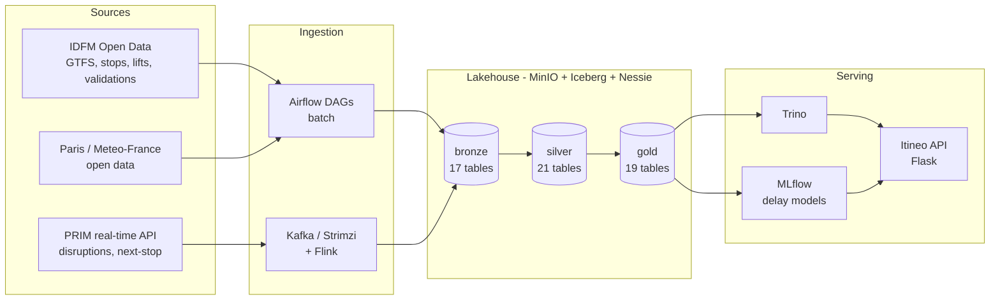

# k8sdatalab — Accessible Journey Recommendations for Île-de-France

A self-hosted **data lakehouse platform** and the application it powers: a daily
notification service that recommends the **2 best public-transport routes** for
travellers with reduced mobility across the Île-de-France region.

Built as a final-year capstone project (Master's in Data Engineering, RNCP36739)
on a self-managed Kubernetes cluster, using **open-source technology only** and
running at minimal cost.

---

## Table of contents

- [What the project does](#what-the-project-does)
- [Architecture](#architecture)
- [Tech stack](#tech-stack)
- [Data sources](#data-sources)
- [Repository layout](#repository-layout)
- [The data platform](#the-data-platform)
- [Batch pipelines](#batch-pipelines)
- [Streaming pipelines](#streaming-pipelines)
- [Machine learning](#machine-learning)
- [Itineo — the application](#itineo--the-application)
- [Itineo API](#itineo-api)
- [Data governance & observability](#data-governance--observability)
- [Infrastructure & GitOps](#infrastructure--gitops)
- [Secrets management](#secrets-management)
- [Platform maintenance](#platform-maintenance)
- [CI/CD](#cicd)
- [Naming conventions](#naming-conventions)

---

## What the project does

A user signs up and creates one or more **subscriptions**, each defined by:

- an origin and a destination within Île-de-France
- a daily notification time
- personal preferences: accessible routing required (lifts mandatory, no stairs),
  crowding sensitivity, minimised transfer walking, maximum number of transfers

Every day at the chosen time, the system computes and sends the **2 best routes**,
ranked by a composite score:

| Criterion | Source |
|---|---|
| Theoretical trip duration | GTFS schedules (gold layer) |
| Predicted reliability | ML delay-prediction model trained on the real-time history we archive ourselves |
| Estimated crowding | Historical Navigo ticket-validation data, matched to the travel hour |
| Cumulative transfer walking distance | GTFS pathways & transfers |
| Accessibility constraints | Station accessibility + **real-time lift status** — an out-of-service lift excludes or downgrades a route |

The point of the project is that every one of these signals is produced by the
platform itself: ingested, versioned, modelled, served, and monitored end to end.

---

## Architecture

Medallion architecture (bronze → silver → gold) on an Iceberg lakehouse, with
**Nessie** providing Git-like branching over the catalog (`dev` → `main`).



Spark is the single processing engine for batch and structured streaming; Trino
is the interactive query engine used by the application and by analysts.

---

## Tech stack

| Layer | Technology |
|---|---|
| Orchestration | Kubernetes (k3s), 1 control-plane + 3 workers |
| GitOps | ArgoCD (app-of-apps, ~25 applications) |
| Object storage | MinIO (distributed, 3 nodes) + MinKMS server-side encryption |
| Table format | Apache Iceberg |
| Catalog | Project Nessie (branches `main` / `dev`) |
| Processing | Apache Spark 3.5 (batch + Structured Streaming) |
| Streaming | Apache Kafka (Strimzi) + Apache Flink |
| Query engine | Trino |
| Workflow | Apache Airflow 3 |
| ML | Spark MLlib + MLflow (tracking & registry) |
| Governance | OpenMetadata (domains, contracts, quality tests, profiler) |
| Lineage | OpenLineage + Marquez |
| Observability | Prometheus + Grafana |
| Secrets | HashiCorp Vault + External Secrets Operator |
| Storage (block) | Longhorn |
| Ingress / TLS | Traefik + cert-manager (OVH DNS-01 webhook) |
| Notebooks | JupyterHub |
| Application | Flask + SQLAlchemy + PostgreSQL |

---

## Data sources

- [GTFS IDFM](https://data.iledefrance-mobilites.fr/explore/dataset/offre-horaires-tc-gtfs-idfm/)
- [Référentiel des arrêts](https://data.iledefrance-mobilites.fr/explore/dataset/arrets/)
- [Relations / zones de correspondance](https://data.iledefrance-mobilites.fr/explore/dataset/relations/)
- [Accessibilité en gare](https://data.iledefrance-mobilites.fr/explore/dataset/accessibilite-en-gare/)
- [État des ascenseurs](https://data.iledefrance-mobilites.fr/explore/dataset/etat-des-ascenseurs/)
- [Validations ferrées – volume journalier](https://data.iledefrance-mobilites.fr/explore/dataset/validations-reseau-ferre-nombre-validations-par-jour-3eme-trimestre/)
- [Profils horaires des validations](https://data.iledefrance-mobilites.fr/explore/dataset/validations-sur-le-reseau-ferre-profils-horaires-par-jour-type-2eme-trimestre-2025/)
- [Messages d'actualité / trafic](https://data.iledefrance-mobilites.fr/explore/dataset/actualites/)
- [Évènements Paris](https://opendata.paris.fr/explore/dataset/que-faire-a-paris-/)
- [Chantiers à Paris](https://opendata.paris.fr/explore/dataset/chantiers-a-paris/)
- [Trottoirs – emprises](https://opendata.paris.fr/explore/dataset/plan-de-voirie-trottoirs-emprises/)
- [Toilettes publiques](https://opendata.paris.fr/explore/dataset/sanisettesparis/)
- [Météo-France observations](https://www.data.gouv.fr/datasets/donnees-d-observation-des-principales-stations-meteorologiques)

Real-time feeds come from the **IDFM PRIM** API (disruptions, next-stop arrivals).

---

## Repository layout

```
.
├── ansible/            # k3s cluster provisioning (nodes, Longhorn prerequisites)
├── argocd/             # GitOps source of truth
│   ├── apps/           #   ArgoCD Application manifests (~25 apps)
│   ├── charts/         #   vendored Helm charts
│   ├── values/         #   per-app Helm values
│   ├── vault-secrets/  #   ExternalSecret manifests (Vault references, no secrets)
│   ├── routes/         #   Traefik IngressRoutes
│   └── streamings/     #   Kafka topics & cluster manifests
├── aws/                # optional EMR Serverless deployment (CloudFormation)
├── docker-images/      # declarative image catalog (spark, airflow, flink, itineo…)
├── src/
│   ├── airflow/dags/   # 9 ETL pipelines + ML + maintenance DAGs
│   ├── spark/jobs/     # 61 Spark jobs, organised bronze / silver / gold / ml
│   ├── flink/jobs/     # Flink streaming jobs
│   ├── kafka/producers/# PRIM API → Kafka producers
│   ├── itineo/         # Flask application (the end-user product)
│   ├── openmetadata/   # governance-as-code (domains, contracts, quality tests)
│   └── notebooks/      # ML exploration
└── .github/workflows/  # image build & publish pipeline
```

---

## The data platform

Data is stored in a single MinIO bucket (`datalake`) under an Iceberg warehouse
managed by Nessie, organised into three layers:

| Layer | Tables | Purpose |
|---|---|---|
| **bronze** | 17 | Raw ingestion, schema-on-write, append-only. GTFS files, PRIM snapshots, validation datasets. |
| **silver** | 21 | Cleaned, typed, deduplicated, conformed entities: `stop_points`, `stop_areas`, `stop_times`, `trips`, `transfers`, `pathways`, `elevators_current` / `elevators_history`, `disruption_*`, `validations_daily`… |
| **gold** | 19 | Business-ready aggregates consumed by the app, dashboards and ML: GTFS schedules/network, accessibility, elevator availability/reliability, validations/crowding, delays and disruptions. |

**Nessie branching** is used as a safety mechanism: pipelines write to the `dev`
branch, and a dedicated DAG merges `dev` into `main` once results are validated —
so consumers of `main` never observe a half-written state.

---

## Batch pipelines

Each domain follows the same DAG shape — `ingest → transform → publish`
(bronze → silver → gold) — with one Spark job per table and sizing profiles
(`spark-small` / `medium` / `large`) chosen per workload.

| DAG | Schedule | Domain |
|---|---|---|
| `etl_gtfs` | every 4 h | GTFS: trips, stop_times, routes, transfers, pathways, wheelchairs… |
| `etl_elevators` | every 4 h | Real-time lift status + history |
| `etl_accessibility` | daily | Station accessibility reference |
| `etl_relations` | daily | Transfer zones / station relations |
| `etl_calendar` | monthly | School holidays, public holidays, day types |
| `etl_validations` | yearly | Navigo validation volumes & hourly profiles |
| `etl_disruptions` | streaming | Disruption messages, periods, affected stops |
| `etl_next_stop` | streaming | Real-time arrival records (delay history) |
| `ml_next_stop` | on demand | Delay-model training |
| `maintenance_iceberg_retention` | daily 02:00 | Snapshot expiry, manifest & data-file compaction |
| `maintenance_nessie_merge` | on demand | Promote `dev` → `main` |

---

## Streaming pipelines

Real-time data is what makes the reliability model possible — the project
archives its own history rather than relying on a published dataset.

1. **Producers** (`src/kafka/producers/`) poll the IDFM PRIM API and publish to
   Kafka topics `idfm-disruptions-raw` and `idfm-next-stop-raw`.
2. **Kafka** runs on Strimzi; topics are declared as manifests in
   `argocd/streamings/`.
3. **Consumers** — Spark Structured Streaming jobs
   (`ingestion_stream_disruptions.py`, `ingestion_stream_next_stop.py`) write
   micro-batches into bronze Iceberg tables, with checkpoints on MinIO.
   A Flink job (`disruptions_raw.py`) covers the same source with a
   lower-latency engine.

The accumulated `next_stop` history is the training set for the delay model.

---

## Machine learning

**Goal:** predict whether a given trip at a given stop will be *on time*, so the
recommender can rank routes by reliability rather than by timetable alone.

- **Features** (`gold.next_stop_features`): line, stop, hour, day type, school
  holidays, recent disruption context, historical delay statistics.
- **Models** — Spark MLlib, benchmarked against each other:
  Logistic Regression, Decision Tree, Random Forest, Gradient-Boosted Trees.
- **Evaluation**: binary + multiclass metrics (AUC, F1, accuracy).
- **Tracking**: every run is logged to **MLflow** (params, metrics, artifacts on
  MinIO, model registry). Exploration lives in
  `src/notebooks/train_next_stop_delay_models.ipynb`.

The resulting per-line/per-stop reliability scores are published back into the
gold layer and consumed by the application.

---

## Itineo — the application

A Flask service (`src/itineo/`) that turns the gold layer into a product.

- **PostgreSQL** stores operational data only: `users`, `subscriptions`, `notifications`.
- **Trino** queries the gold lakehouse tables directly — no analytical data is
  duplicated into Postgres.
- **APScheduler** triggers the daily dispatch per subscription.

| Module | Responsibility |
|---|---|
| `auth.py` / `subscriptions.py` | JWT authentication, subscription CRUD |
| `geocoding.py` | address → stop resolution |
| `gold.py` | Trino client and gold-layer queries |
| `accessibility.py` | station, transfer and elevator accessibility API |
| `analytics.py` | crowding, delays, disruptions and network API |
| `routing.py` | candidate route generation (direct + one transfer) |
| `scoring.py` | 5-criteria scoring, top-2 selection |
| `engine.py` / `recommender.py` | search orchestration |
| `notifications.py` / `scheduler.py` | daily dispatch and history |

**Scoring** — candidates are min-max normalised across the candidate set, then
blended with weights derived from user preferences:

```
score = w_duration    * (shorter trip)
      + w_reliability * (predicted on-time rate of the lines used)
      + w_crowding    * (lower estimated validations at the travel hour)
      + w_walking     * (lower cumulative transfer walking distance)
```

Routes violating a hard accessibility constraint — including a lift currently
reported out of service — are excluded or downgraded before scoring.

### Itineo API

Itineo now exposes both journey recommendations and read-only mobility analytics
from the Gold layer. Analytical data is queried through Trino and is not copied
into PostgreSQL.

- Cluster URL: `https://itineo.k8sdatalab.com`
- Local URL: `http://localhost:8000`
- Swagger UI: `/apidocs/` (Basic Auth when `SWAGGER_USER` and
  `SWAGGER_PASSWORD` are configured)
- OpenAPI specification: `/apispec_1.json`
- Health check: `GET /health`

| Domain | Method and endpoint | Description |
|---|---|---|
| Journey search | `POST /search` | Rank accessible itineraries from an address, coordinates or station |
| Accessibility | `GET /accessibility/summary` | Network-wide accessibility indicators |
| Accessibility | `GET /accessibility/stations` | Search and filter station accessibility |
| Accessibility | `GET /accessibility/stations/<station_id>` | Details for one parent station |
| Accessibility | `GET /accessibility/transfers` | Transfer distance, equipment and accessibility |
| Elevators | `GET /accessibility/elevators` | Current availability by station |
| Elevators | `GET /accessibility/elevators/reliability` | Outages and uptime over 30/90 days |
| Elevators | `GET /accessibility/elevators/outages` | Ongoing and historical outage events |
| Crowding | `GET /crowding/summary` | Validation-based network indicators |
| Crowding | `GET /crowding/stations` | Stations ranked by estimated validation volume |
| Crowding | `GET /crowding/timeseries` | Daily validation time series |
| Crowding | `GET /crowding/ticket-categories` | Validation distribution by ticket category |
| Delays | `GET /delays/summary` | Passage-weighted punctuality summary |
| Delays | `GET /delays/lines` | Line punctuality ranking |
| Delays | `GET /delays/recent` | Recently ingested delayed passages |
| Disruptions | `GET /disruptions/active` | Active messages, severity and impacted lines |
| Disruptions | `GET /disruptions/history` | Daily disruption counts by line |
| Network | `GET /network/lines` | GTFS line catalogue and coverage |
| Network | `GET /network/lines/<route_id>/stations` | Stations served by one route |
| Privacy | `GET /privacy` | Public privacy notice and available data rights |
| Privacy | `GET /privacy/me` | JWT-protected portable personal-data export |
| Privacy | `PATCH /privacy/me` | JWT/password-protected data rectification |
| Privacy | `DELETE /privacy/me` | JWT/password-protected account erasure |
| Accounts | `POST /auth/signup`, `POST /auth/login` | Registration and JWT creation |
| Subscriptions | `GET/POST /subscriptions`, `DELETE /subscriptions/<id>` | JWT-protected subscription management |
| Notifications | `GET /notifications`, `POST /notifications/preview/<id>` | JWT-protected history and preview |

The crowding endpoints expose **estimates based on ticket validations**, not
real-time passenger occupancy. Dates use `YYYY-MM-DD`. Collection routes return
at most 500 rows and use the following envelope:

```json
{
  "count": 1,
  "limit": 100,
  "offset": 0,
  "items": []
}
```

Common filters include `q`, `line`, `date_from`, `date_to`, `limit` and
`offset`. Domain-specific filters include `accessible`, `available`, `ongoing`,
`hour`, `cat_jour`, `severity`, `min_delay_sec` and `since_hours`.

```bash
# Overall accessibility
curl "http://localhost:8000/accessibility/summary"

# Morning crowding estimates for a normal weekday
curl "http://localhost:8000/crowding/stations?hour=8&cat_jour=JOHV&limit=20"

# Line punctuality and active disruptions
curl "http://localhost:8000/delays/summary?line=A"
curl "http://localhost:8000/disruptions/active?line=IDFM:C01371"

# Elevator outages currently in progress
curl "http://localhost:8000/accessibility/elevators/outages?ongoing=true&since_days=30"
```

The privacy API supports access/portability, rectification and erasure of the
personal data stored by the application. Configure a real, monitored
`PRIVACY_CONTACT_EMAIL` before deployment; `GET /privacy` reports a configuration
warning while it is missing. Deleting an account also deletes its subscriptions
and notification history and invalidates JWTs whose user no longer exists.

These technical controls support GDPR data-subject rights but are not a complete
legal-compliance programme. The deployment owner remains responsible for the
processing register, retention and backup policies, processor agreements,
security controls, breach procedures and non-API requests.

See [`src/itineo/README.md`](src/itineo/README.md) for request bodies, detailed
filters, Gold-table mappings and local startup instructions.

---

## Data governance & observability

Governance is managed **as code** (`src/openmetadata/configs/`) and applied by a
Kubernetes job, rather than clicked through a UI:

- **Domains & organisation** — data domains, teams, ownership
- **Descriptions** — column- and table-level documentation
- **Data contracts** — schema expectations on critical tables
- **Quality tests** — assertions executed by OpenMetadata
- **Profiler** — column statistics and distribution tracking

Alongside it:

- **Marquez / OpenLineage** — job-level lineage across the medallion layers
- **Prometheus + Grafana** — cluster and platform metrics
- **Spark History Server** — post-mortem analysis of Spark jobs

---

## Infrastructure & GitOps

- **Provisioning** — Ansible playbooks install k3s across the nodes and prepare
  Longhorn prerequisites. Node inventory secrets are ansible-vault encrypted.
- **GitOps** — ArgoCD reconciles ~25 applications from `argocd/apps/`. Every
  platform component (MinIO, Trino, Airflow, Nessie, Vault, Kafka, MLflow,
  OpenMetadata, monitoring…) is declared here; nothing is applied by hand.
- **Namespaces** — `data-platform`, `apps`, `observability`, `mlops`,
  `streaming`, `spark-jobs`, `vault`, `argocd`.
- **Ingress** — Traefik IngressRoutes with wildcard TLS issued by cert-manager
  through the OVH DNS-01 webhook.
- **Optional cloud burst** — `aws/` contains a CloudFormation template to run the
  same Spark jobs on EMR Serverless when the on-prem cluster is too small.

---

## Secrets management

No credential is stored in this repository.

- **HashiCorp Vault** is the single source of truth (KV v2, `prod/<app>/<item>`).
- **External Secrets Operator** syncs Vault values into Kubernetes Secrets via
  the `ExternalSecret` manifests in `argocd/vault-secrets/` — those manifests
  contain only *paths*, never values.
- **MinIO** objects are encrypted server-side through **MinKMS**, itself sealed
  by Vault Transit.
- Local development files (`.env`, `kubeconfig.yaml`, `.vault-password`) are
  gitignored.

---

## Platform maintenance

Running a lakehouse on a small cluster means storage discipline is part of the
engineering work:

- **Iceberg retention** (`maintenance_iceberg_retention`, daily) — snapshot
  expiry, manifest rewriting and data-file compaction, with per-layer retention
  policies (bronze 30 d, silver 10 d, gold 7 d).
- **Nessie GC** — because Nessie owns file lifecycle across branches, Iceberg's
  own `expire_snapshots` does not reclaim storage on its own; physical cleanup
  requires the Nessie GC tool, which walks every live reference before deleting
  unreferenced files.
- **Log retention** — Airflow and Spark event logs on MinIO are pruned on a
  rolling window.

---

## CI/CD

`.github/workflows/` builds and publishes the project's container images
(`spark`, `spark-base`, `airflow`, `flink`, `kafka`, `mlflow`, `itineo`,
`jupyterhub-datalab`, `aws-spark-emr`) to Docker Hub.

The catalog is declarative (`docker-images/build-config.yml`): each image
declares the repository paths it embeds (`depends_on`) and the images it builds
`FROM` (`depends_on_images`), so a change to `src/spark/jobs` triggers a rebuild
of the Spark image *and* everything derived from it — and nothing else.

---

## Naming conventions

| Item | Pattern | Example |
|---|---|---|
| MinIO bucket | `{env}-{layer}` | `prod-bronze` |
| Object path | `{source}/{entity}/{yyyy}/{mm}/{dd}/` | `crm/customers/2025/04/10/` |
| DAG ID | `etl_{domain}` | `etl_gtfs` |
| Task ID | `{verb}_{object}__{layer}` | `transform_gtfs__silver` |
| Spark job | `{layer}_{entity}_{action}` | `silver_orders_deduplication` |
| Table | `{catalog}.{schema}.{entity}` | `nessie.silver.stop_times` |
| Metadata column | `_{column_name}` | `_ingested_at`, `_source_file` |

---

## Status

This is a student capstone project running on a personal cluster. It is shared
for portfolio and educational purposes; it is not a production service and comes
with no guarantee of availability.
